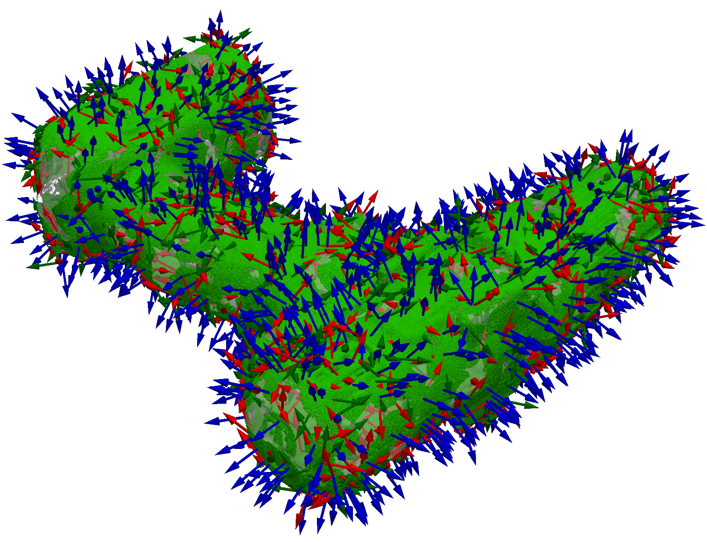
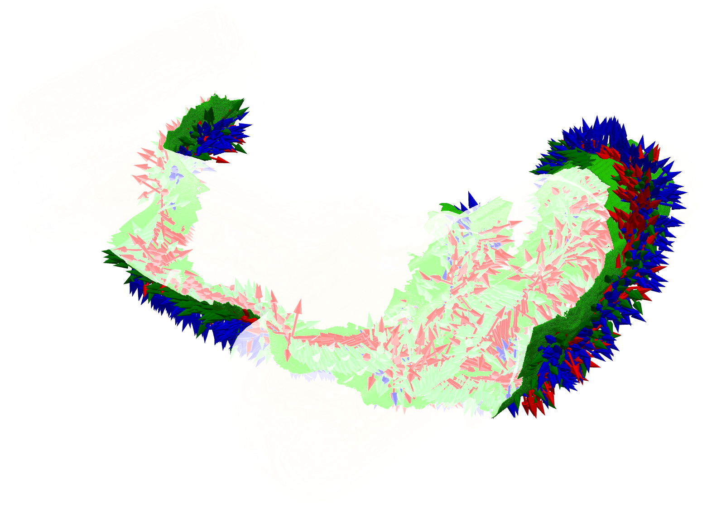
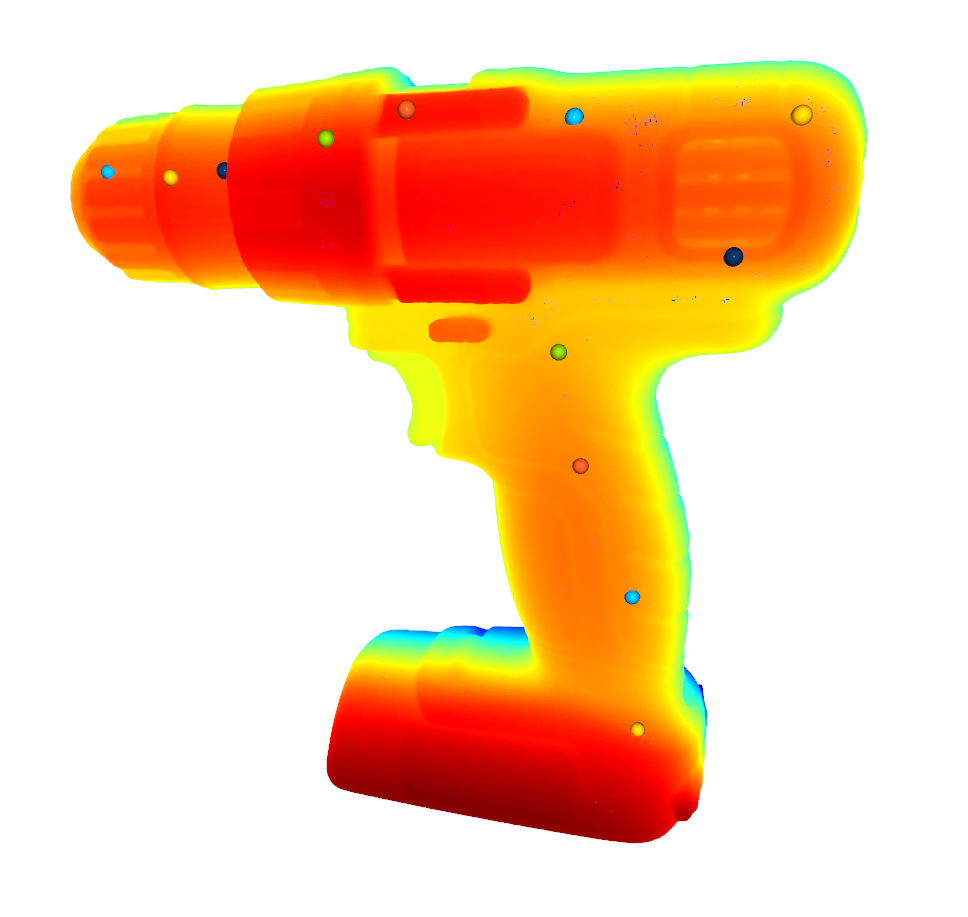

# Data generation: YCB-Slide and training corpus

The subfolder consists of scripts to generate [TACTO](https://github.com/facebookresearch/tacto) simulated interactions with YCB-objects. These can be done in three ways: 

## 1. Densely sample object meshes
This is used to generate tactile training data, with DIGIT background and lighting augmentation. 
```python
python midastouch/data_gen/generate_data.py method=train_data
```
<div align="center">
  
</div>

## 2. Generate random sliding trajectories
This is used to recreate the trajectories from the YCB-Slide dataset.

```python
python midastouch/data_gen/generate_data.py method=ycb_slide
```
 
<div align="center">
  
</div>

## 3. Manually generate custom sliding trajectories
This is used for custom trajectories entirely defined by user generated waypoints.

```python
python midastouch/data_gen/generate_data.py method=manual_slide
```

<div align="center">
  
</div>

---

## Fine-grained settings

Modify the hydra `.yaml` parameters in the `./config` folder for more fine-grained settings:

```yaml
obj_class: ycb_test # ycb_test: 10 evaluation objects in the MidasTouch paper, ycb_train: 40 training objects for the depth network training  
obj_model: 035_power_drill
sampling : traj # choose between (random, random+edges, traj, manual)
save_path : ./ycb_slide # all data is saved in the hydra output folder
noise: # noise to corrupt poses 
  sig_r: 1  # degrees
  sig_t: 5e-4  # m

num_samples : 2000 # number of interactions
total_length : 0.5 # maximum path length for geodesic paths

render:
  pixmm : 0.03 # pix to mm conversion for the DIGIT
  width : 240  # width of images
  height : 320 # height of images 
  cam_dist : 0.022 # distance between gel and camera 
  shear_mag : 5.0 # shear angle noise 
  pen : 
    min : 0.0005 # minimum penetration into object 
    max : 0.001 # maximum penetration into object
  randomize : False # randomize the template backgrounds and lighting augmentation
```

---
## Other notes 

- The generated data is saved in timestamped folders in the hydra `output` directory
- To use this data to train your tactile depth network, refer to the `contrib/tdn_fcrn` folder 
- To use this data in filtering experiments, refer to the `filter/filter.py` script